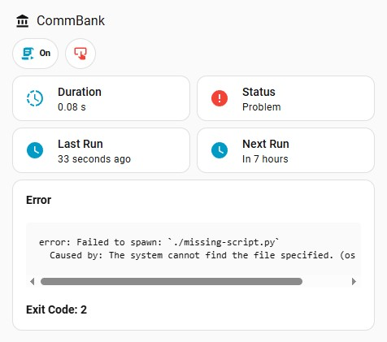
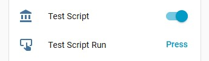

# Scheduled Tasks

One of System Link's coolest features is its ability to be used as a script runner with tight integration into Home Assistant.

This is done using [cron switches](../components/switches/cron.md), which allow you to run scripts on a schedule, or on-demand, and report to Home Assistant about their status, execution time, next/last run, error messages, and more.

You can also combine this with [custom sensors](../components/sensors/custom.md) to send data back to Home Assistant from your scripts.

Here's an example dashboard card you can create to monitor your scheduled tasks:

<figure markdown="span">
  
</figure>

??? info "Entity images"

    
    

--8<-- "docs/snippets/scheduled-task-grid.md"

??? quote "My rambling"

    I've tried a lot of other ways to integrate scripts with Home Assistant, but this is by far the easiest and most robust way I've found, short of actually building custom integrations for HA, which I have done for various services, but it is a lot more work.

    I've also tried using HA's rest commands, rest sensors, custom scripts that send data back via mqtt to HA with custom mqtt sensors. I also built a custom healthchecks integration, tried uptime kuma. But they all required a lot more work or lacked important features (like support for dependencies).

    This finally allows me to just write simple scripts that can be detached from HA, use whatever deps I need, install the deps/python version I want on the fly, and easily integrate monitoring and results back into HA.

    It's a great extension of system links core features of monitoring and basic remote control. I realised I could make it completely manage and return data from my scripts, obsoleting some of my old more custom methods. I'd be curious to hear the community's thoughts on this approach, and how I can improve it even further.

## Python Scripts & Dependencies

The docker container for System Link includes both Python and [UV](https://github.com/astral-sh/uv).

UV is a really fast python manager, with a lot of useful features. It handles python workspaces, installing deps, installing python versions of the fly, and more.

In particular, [inline metadata for dependencies](https://docs.astral.sh/uv/guides/scripts/#declaring-script-dependencies) is really useful here. This allows you to declare dependencies at the top of your script file, and uv will automatically install them when the script is run and then cache them for future runs.

This means the first run of the scheduled script might be a bit slower, but it also means you don't have to install dependencies locally using a venv or bake them into your docker image yourself.

!!! tip

    It particularly shines for simple scripts you may write as you can pin the deps and python version right there in the script file, and uv will install them automatically and run the script for you in a isolated environment. Meaning you don't have to worry about dependency conflicts with other scripts.

Here's a simple example, but check uv docs for [more info](https://docs.astral.sh/uv/guides/scripts/#declaring-script-dependencies).

```python
# /// script
# requires-python = ">=3.13"
# dependencies = [
#   "beautifulsoup4==4.13.3",
#   "cryptography==44.0.1",
#   "requests==2.32.4",
# ]
# ///

import json
import logging.handlers
from os import getenv

from cryptography.fernet import Fernet

from commbank import Client

# ...
```

## Guide

For this example we are going to create a script to pull our bank account information from CommBank, using the System Link docker container.

First, let’s set up the basic config, with a cron switch and a custom sensor for the account information.

```yaml title="/config/config.yaml" linenums="1"
# device_name: "PyScripts"
# host_id: b341751b-367b-4d7c-9c93-a960a20535a6

# mqtt: ...

buttons: # (1)!
  - reload: {}
  - reset_topics: {}

sensors:
  - custom:
      name: "CommBank Smart Access"
      icon: mdi:bank
      unique_id: commbank_smart_access
      unit_of_measurement: AUD
      device_class: monetary
      state_class: total
      command: cat /app/commbank/account.json
      value_template: "{{ value_json.balance }}" # (2)!
      json_attributes: # (3)!
        - account_name
        - available_balance
        - bsb
        - account_number
        - transactions

switches:
  - cron:
      name: "CommBank Script"
      icon: mdi:bank
      unique_id: commbank_script
      schedule: "15 0 * * *"
      command: uv run /app/commbank/commbank.py
      # show_output: true
      # show_errors: true
      entities:
        successful: {}
        duration: {}
        run: {}
        next_run: {}
        last_run: {}
```

1. We're using Docker, so you don't need most of the other buttons (shutdown, exit, etc.).
2. The `command` returns a JSON string; Home Assistant will parse it and `value_template` extracts the `balance`.
3. Extra fields to include in the sensor's attributes.

Now we can create a script to pull the data from CommBank and write a JSON file with the results.

```python title="/app/commbank/commbank.py" linenums="1"
# /// script
# requires-python = ">=3.13"
# dependencies = [
#   "requests==2.32.4",
#   "beautifulsoup4==4.13.3",
# ]
# ///

import json
import os
from commbank import Client # (1)!

USERNAME = os.getenv("COMMBANK_USERNAME")
PASSWORD = os.getenv("COMMBANK_PASSWORD")
OUTPUT_FILE = "/app/commbank/account.json"

def main():
    client = Client(timeout=10)
    client.login(USERNAME, PASSWORD)

    account = client.account(12345678)
    account_data = {
        "account_name": account.name,
        "balance": account.balance,
        "available_balance": account.available_balance,
        "bsb": account.bsb,
        "account_number": account.number,
        "transactions": account.transactions(limit=5),
    }

    with open(OUTPUT_FILE, "w") as f:
        f.write(json.dumps(account_data))

if __name__ == "__main__":
    main()
```

1. This is based on a lib I threw together a long time ago [jcwillox/commbank-api](https://github.com/jcwillox/commbank-api), it's not something I really maintain, but the source is there. You could also spin up a headless browser or call any other APIs you like.

???+ example "Adding extra logging"

    You can also add extra logging to your script and write it to a file.

    ```python
    import logging
    import logging.handlers

    # Setup logging
    _LOGGER = logging.getLogger("commbank")
    _LOGGER.setLevel(logging.DEBUG)
    handler = logging.handlers.RotatingFileHandler(
        "/app/commbank/commbank.log", maxBytes=1000000, backupCount=3
    )
    formatter = logging.Formatter(
        "%(asctime)s %(levelname)s [%(name)s] %(message)s", "%Y-%m-%d %H:%M:%S"
    )
    handler.setFormatter(formatter)
    _LOGGER.addHandler(handler)

    def main():
        _LOGGER.info("Starting CommBank script")
        # ...
        _LOGGER.info("Successfully retrieved account data")

    if __name__ == "__main__":
        try:
            main()
        except Exception as ex:
            _LOGGER.exception("Error in main method, script aborted!\n\n")
            raise ex
    ```

### Docker setup

Below are concise examples for organizing scripts, running the container, and a `docker-compose` service you can adapt.

* **File layout**

```text
/pyscripts
├─ config.yaml           # config file
├─ logs/                 # log directory
└─ app/
   └─ commbank/
      ├─ commbank.py     # script file
      └─ account.json    # output file written by the script
```

* **Starting the container**


=== "docker run"

    ```bash
    docker run -d \
      --name system-link \
      -v /path/to/app:/app \
      -v /path/to/logs:/logs \
      -v /path/to/config.yaml:/config/config.yaml \
      --restart unless-stopped \
      ghcr.io/jcwillox/system-link:python3-alpine
    ```

=== "docker-compose.yaml"

    ```yaml
    services:
      system-link:
        image: ghcr.io/jcwillox/system-link:python3-alpine
        restart: unless-stopped
        volumes:
          - /path/to/app:/app
          - /path/to/logs:/logs
          - /path/to/config.yaml:/config/config.yaml
    ```
